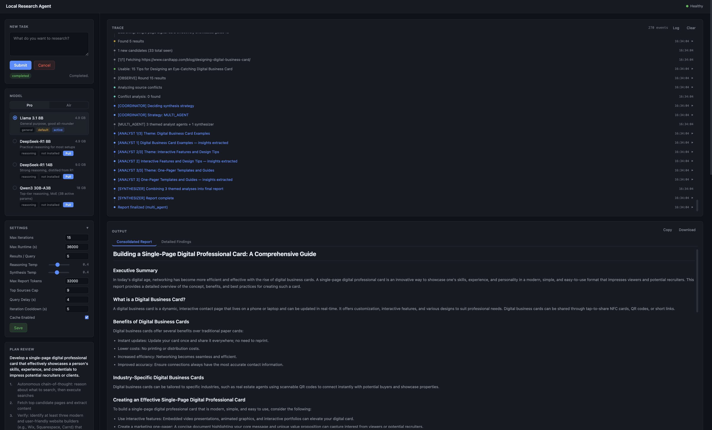

# Local Research Agent

> **Autonomous AI researcher that runs 100% on your machine.**  
> Give it any question or task, it thinks, searches the web, reads pages, critiques itself, and writes a detailed report. No cloud APIs required.

<p align="center">
  
  <br/>
  <em>Live trace panel · Consolidated report · Source list · Collapsible settings</em>
</p>

<p align="center">
  
  
  
  
  
  
</p>

---

## What makes this different

Most "AI research" tools wrap a single LLM call. This one runs an **autonomous agent loop** ,  the model actively plans, searches, reads web pages, critiques its own gaps, and iterates until it's confident the research is thorough. Think Auto-GPT / ChaosGPT principles applied to research, running locally.

- **No OpenAI key.** No Tavily key. No paid APIs of any kind.
- **Transparent.** Every thought, query, fetch, and decision is streamed live to the UI.
- **Persistent.** All traces, sources, and reports survive restarts and reload on demand.
- **Configurable.** Every tunable value is exposed ,  in a config file for developers, in the UI for users.

---

## Table of Contents

- [How it works](#how-it-works)
- [Key features](#key-features)
- [Tech stack](#tech-stack)
- [Architecture](#architecture)
- [Project structure](#project-structure)
- [Quick start](#quick-start)
- [GPU / MPS acceleration](#gpu--mps-acceleration)
- [Configuration](#configuration)
- [Settings panel (UI)](#settings-panel-ui)
- [Adding a screenshot](#adding-a-screenshot)
- [API reference](#api-reference)
- [Task lifecycle](#task-lifecycle)
- [Output format](#output-format)
- [Troubleshooting](#troubleshooting)
- [Contributing](#contributing)
- [License](#license)

---

## How it works

```
Submit task
    │
    ▼
Goal formulation  —  converts the task into a clear goal + research criteria
    │
    ▼
Multi-agent planning  —  4 agents build a detailed research plan
  (Intent Clarifier → Topic Decomposer → Question Expander → Plan Critic)
    │
    ▼
Autonomous research loop  (repeats until criteria are met or time limit)
  ┌─────────────────────────────────────────────────────────────────────┐
  │  Iteration 1 — BOOTSTRAP                                            │
  │    criteria → initial queries → search + fetch → ANALYST            │
  │                                                                     │
  │  Iterations 2+ — Full 5-agent cycle                                 │
  │    REFLECT    — Senior Scientist: updates working thesis, decides   │
  │                 continue/stop, provides honest self-critique         │
  │    CHALLENGE  — Skeptical Reviewer: finds weaknesses, generates     │
  │                 disconfirming search queries                         │
  │    DISCOVER   — Pattern Spotter: cross-connects findings, surfaces  │
  │                 hidden angles, suggests new research directions      │
  │    STRATEGIZE — Search Strategist: plans phase-adaptive queries     │
  │                 targeting gaps, challenges, and new leads            │
  │    ACT        — web search + page fetch + extraction                │
  │    ANALYZE    — Forensic Analyst: reads new documents, rates source │
  │                 credibility (PRIMARY / SECONDARY / TERTIARY)        │
  └─────────────────────────────────────────────────────────────────────┘
    │
    ▼
Coordinator agent  —  chooses synthesis strategy:
  • DIRECT      → per-section writers (focused topics)
  • MULTI_AGENT → per-source fact extractors + analyst + section writers
    │
    ▼
Clean markdown report  —  rendered in UI, copy/download available
```

Each agent is a **modular cognitive unit** — it knows only its role, not the pipeline. The orchestrator wires them together via a structured `ResearchMemory` (working thesis, confidence scores, source credibility, cross-connections, challenges) that evolves across iterations.

---

## Key features

| | Feature |
|---|---|
| 🔬 | **5-agent autonomous loop** — REFLECT, CHALLENGE, DISCOVER, STRATEGIZE, ANALYZE each do one cognitive task deeply |
| 🧠 | **Working thesis** — evolving belief per research criterion, updated and stress-tested every iteration |
| ⚔️ | **Active disconfirmation** — dedicated CHALLENGE agent seeks evidence that disproves current beliefs |
| ⭐ | **Source credibility ratings** — PRIMARY / SECONDARY / TERTIARY labels applied inline by the Forensic Analyst |
| 🔗 | **Cross-connection discovery** — DISCOVER agent finds patterns across research areas that humans miss |
| 🎯 | **Goal formulation** — converts any task into specific, searchable research angles before starting |
| 🗂️ | **Multi-agent planning** — 4 planning agents build a detailed research plan before the loop starts |
| 🤝 | **Adaptive synthesis** — coordinator picks single-shot or multi-agent strategy based on complexity |
| 📡 | **Live trace streaming** — every agent call, query, fetch, and decision streamed via SSE; replayed from DB |
| 🔁 | **Duplicate query guard** — stem-normalized dedup prevents looping; criteria fallback when stuck |
| 🚫 | **Junk domain filtering** — search engines (Google, Bing, Yandex…) auto-skipped |
| 🌐 | **Browser fallback** — Playwright/Chromium re-fetches pages where HTTP extraction is weak |
| 🆓 | **Free web search** — DuckDuckGo with exponential backoff; zero API costs |
| 🗄️ | **Full SQLite persistence** — tasks, sources, steps, traces, cache, and settings |
| ⚙️ | **UI settings panel** — all tunable values editable from the browser, persisted to SQLite |

---

## Tech stack

| Layer | Technology |
|-------|-----------|
| LLM runtime | [Ollama](https://ollama.ai) — local model server |
| Recommended model | `llama3.1:8b` (or any Ollama-compatible model) |
| Web framework | [FastAPI](https://fastapi.tiangolo.com) + [Uvicorn](https://www.uvicorn.org) |
| Data validation | [Pydantic v2](https://docs.pydantic.dev) |
| Web search | [DuckDuckGo Search](https://github.com/deedy5/duckduckgo_search) (free, no key) |
| HTTP client | [HTTPX](https://www.python-httpx.org) (async) |
| Browser automation | [Playwright](https://playwright.dev/python/) (Chromium, headless) |
| Content extraction | [Trafilatura](https://trafilatura.readthedocs.io) + [Jina Reader](https://jina.ai/reader/) (fallback) |
| Vector similarity | [ChromaDB](https://www.trychroma.com) (optional, for semantic fact retrieval) |
| Database | SQLite (via Python stdlib `sqlite3`) |
| Frontend | Vanilla JS + SSE + [marked.js](https://marked.js.org) for markdown rendering |
| Containerisation | Docker + Docker Compose |

---

## Architecture

```
Browser  (static/index.html)
    │  REST + Server-Sent Events
    ▼
FastAPI  (app/main.py)
    │
    ├── Repository (app/repository.py)     SQLite — tasks, sources, steps, traces, cache, settings
    │
    ├── Pipeline (app/pipeline.py)         ResearchMemory · autonomous loop · synthesis orchestration
    │     │  ResearchMemory tracks: working thesis, confidence, source credibility,
    │     │  cross-connections, challenges, surprises, search history, saturation
    │     │
    │     ├── Services (app/services.py)   5 reasoning agents · Ollama LLM · DuckDuckGo
    │     │     ├── analyze_round()        Forensic Analyst — reads docs, rates credibility
    │     │     ├── reflect_and_reason()   Senior Scientist — updates thesis, decides stop/continue
    │     │     ├── challenge_beliefs()    Skeptical Reviewer — disconfirming queries
    │     │     ├── discover_new_angles()  Pattern Spotter — cross-connections, new directions
    │     │     └── strategize_next_move() Search Strategist — phase-adaptive queries
    │     │
    │     └── Reporting (app/reporting.py) Coordinator · fact extractors · section writers · markdown
    │
    └── Config (app/config.py)             All constants — per-agent timeouts, temps, context budgets
```

### Two-tier configuration

| Tier | File | Who edits it |
|------|------|-------------|
| All defaults | `app/config.py` | Developer (code change) |
| User overrides | `Settings` model (SQLite) | Anyone via the UI Settings panel |

User settings override `config.py` defaults and are applied per-task at run time with no restart.

---

## Project structure

```
local-research-agent/
├── app/
│   ├── main.py          FastAPI app, all endpoints, startup hooks
│   ├── pipeline.py      Autonomous loop (THINK→ACT→OBSERVE) + synthesis orchestration
│   ├── services.py      LLM calls, web search, HTTP/browser fetch, content extraction
│   ├── reporting.py     Coordinator, analyst agents, synthesizer, markdown cleanup
│   ├── repository.py    SQLite schema + all persistence operations
│   ├── schemas.py       Pydantic models ,  Settings, TaskPlan, Events, etc.
│   ├── config.py        Central constants (temperatures, timeouts, thresholds, caps)
│   ├── diagnostics.py   Health checks and readiness checks
│   └── retry_utils.py   Bounded retry / backoff utility
├── static/
│   └── index.html       Single-page UI ,  trace · output tabs · settings · history
├── scripts/
│   └── easy_start.sh    One-command bootstrap / start
├── tests/
│   ├── test_diagnostics_and_lifecycle.py
│   ├── test_reporting.py
│   └── test_schemas_phase4.py
├── Dockerfile
├── docker-compose.yml
└── requirements.txt
```

---

## Quick start

### Option A: Docker (recommended)

**Prerequisites:** [Docker Desktop](https://www.docker.com/products/docker-desktop/) and [Ollama](https://ollama.ai) installed.

```bash
# 1. Clone the repo
git clone https://github.com/your-username/local-research-agent.git
cd local-research-agent

# 2. Start everything (builds image, starts Ollama + app)
docker compose up --build -d

# 3. Open in your browser
open http://localhost:8000
```

The first run pulls the `llama3.1:8b` model (~5 GB). Use the **Model** panel in the UI to switch models.

Stop:
```bash
docker compose down
```

> After any code change, rebuild to pick up updates:
> ```bash
> docker compose up --build -d
> ```

### Option B: Local Python

**Prerequisites:** Python 3.12+, [Ollama](https://ollama.ai) running locally.

```bash
# Pull a model first
ollama pull llama3.1:8b

# Set up the project
git clone https://github.com/your-username/local-research-agent.git
cd local-research-agent
python3 -m venv .venv
source .venv/bin/activate        # Windows: .venv\Scripts\activate
pip install -r requirements.txt
python -m playwright install chromium

# Run
uvicorn app.main:app --reload
```

Open: `http://localhost:8000`

---

## GPU / MPS acceleration

> **TL;DR** — Ollama handles GPU inference automatically when running natively. In Docker on Mac, GPU passthrough to the container is not supported, so use the Mac override to connect to your host Ollama instead.

### Apple Silicon (M1 / M2 / M3 / M4)

Ollama uses **Metal / MPS** automatically when run natively. The trick is that the bundled Docker Ollama container runs inside a Linux VM and **cannot reach the host GPU**.

**Recommended setup (fastest inference):**
```bash
# 1. Run Ollama natively (uses MPS automatically)
ollama serve                    # or just open Ollama.app

# 2. Pull your model
ollama pull llama3.1:8b

# 3. Start only the app container, pointing it to host Ollama
docker compose -f docker-compose.yml -f docker-compose.mac.yml up --build -d
```

The `docker-compose.mac.yml` override removes the Docker Ollama service and sets `OLLAMA_BASE_URL=http://host.docker.internal:11434`.

**Verify MPS is active:**
```bash
# While a model is running, check GPU usage in Activity Monitor
# → Window → GPU History, or:
sudo powermetrics --samplers gpu_power -i 1000 -n 3
```

**Best models for Apple Silicon:**

| VRAM | Recommended model | Quantisation |
|------|-------------------|-------------|
| 8 GB  | `llama3.1:8b` | Q4_K_M (default) |
| 16 GB | `llama3.1:8b` or `mistral:7b` | Q8_0 |
| 32 GB | `llama3.1:8b` + longer context | Q8_0 |
| 64 GB | `llama3.3:70b` | Q4_K_M |

Pull a specific quantisation: `ollama pull llama3.1:8b-instruct-q8_0`

---

### NVIDIA GPU (Linux / WSL2)

The `docker-compose.nvidia.yml` override passes all NVIDIA GPUs into the Ollama container.

**Requirements:** [nvidia-container-toolkit](https://docs.nvidia.com/datacenter/cloud-native/container-toolkit/install-guide.html) installed on the host.

```bash
docker compose -f docker-compose.yml -f docker-compose.nvidia.yml up --build -d
```

**Verify GPU is being used:**
```bash
docker exec lra-ollama nvidia-smi
docker exec lra-ollama ollama ps     # shows model + VRAM used
```

**To use a specific GPU** (multi-GPU host), set `CUDA_VISIBLE_DEVICES` in the override file or via env:
```bash
CUDA_VISIBLE_DEVICES=0 docker compose -f docker-compose.yml -f docker-compose.nvidia.yml up -d
```

---

### Option B: run locally (always GPU-native)

Running with `uvicorn` directly (not Docker) means Ollama, sentence-transformers, and ChromaDB all run on bare metal and pick up MPS or CUDA automatically — no overrides needed.

```bash
ollama serve &
uvicorn app.main:app --reload
```

---

### Environment variables

| Variable | Default | Description |
|----------|---------|-------------|
| `OLLAMA_BASE_URL` | `http://localhost:11434` | Ollama API endpoint |
| `RECOMMENDED_MODEL` | `llama3.1:8b` | Default model pre-selected in the UI |
| `LRA_DB_PATH` | `local_research_agent.db` | SQLite database path |
| `LRA_TRACE_LOG_DIR` | `trace_logs/` | Directory for per-task `.txt` trace logs |

### `app/config.py` — all developer constants

Edit this file to tune anything not exposed in the UI:

```python
# LLM
OLLAMA_DEFAULT_TIMEOUT   = 600    # seconds per LLM call (generous for local models)
SYNTHESIS_TEMPERATURE    = 0.4    # report writing style
SYNTHESIS_MAX_TOKENS     = 8192   # report output length

# Per-agent settings (all 5 agents fully configurable)
REFLECT_TEMPERATURE      = 0.4    # Senior Scientist creativity
REFLECT_MAX_TOKENS       = 2000
CHALLENGE_TEMPERATURE    = 0.5    # Skeptical Reviewer creativity
DISCOVER_TEMPERATURE     = 0.6    # Pattern Spotter — slightly more exploratory
STRATEGY_TEMPERATURE     = 0.4    # Search Strategist
ANALYSIS_ROUND_MAX_TOKENS = 1500  # Forensic Analyst output budget

# Context budgets (chars passed to agent prompts)
INSIGHTS_BUDGET          = 6000   # accumulated findings
SOURCES_BUDGET           = 8000   # raw docs for ANALYZE
THESIS_BUDGET            = 2000   # working thesis summary

# Search
INTER_QUERY_DELAY        = 4.0    # seconds between DDG queries
INTER_ITERATION_COOLDOWN = 5.0    # seconds between loop iterations
SEARCH_RETRY_COUNT       = 5      # DDG retries on rate limit
MAX_QUERY_WORD_COUNT     = 8      # reject sentence-like queries

# Loop control
SATURATION_THRESHOLD     = 3      # empty rounds before giving up
MAX_DISCOVERED_CRITERIA  = 3      # cap on new research directions

# Synthesis
TOP_SOURCES_CAP          = 9      # sources passed to synthesis
SOURCE_CONTENT_LENGTH    = 6000   # chars fed per source
```

---

## Settings panel (UI)

Click the **Settings ▶** card in the left sidebar to expand it. Changes persist to SQLite and apply to the next task ,  no restart needed.

| Setting | Default | Description |
|---------|---------|-------------|
| Max Iterations | 10 | THINK→ACT→OBSERVE cycles before forced synthesis |
| Max Runtime (s) | 36000 | Hard timeout (10 hours); partial report saved if hit |
| Results / Query | 5 | URLs fetched per DuckDuckGo query |
| Reasoning Temp | 0.4 | LLM creativity during thinking (0 = focused, 1 = creative) |
| Synthesis Temp | 0.4 | LLM creativity when writing the report |
| Max Report Tokens | 8192 | Maximum output length of the final report |
| Top Sources Cap | 9 | Top-ranked sources passed to synthesis |
| Query Delay (s) | 4.0 | Pause between DDG queries (rate limit avoidance) |
| Iteration Cooldown (s) | 5.0 | Pause between full research iterations |
| Cache Enabled | ✓ | Re-use previously fetched pages |

Click **Reset Settings** in the diagnostics panel (top-right health dot) to restore all defaults.

---

## Adding a screenshot

To add a real screenshot for the `docs/screenshot.png` placeholder at the top of this README:

```bash
mkdir -p docs
# Take a screenshot of http://localhost:8000 while a task is running
# and save it as docs/screenshot.png
```

A good screenshot to capture: start a research task, wait for a few trace events to appear, then screenshot the full page showing the trace panel on the left and the output panel on the right.

---

## API reference

### Tasks

| Method | Endpoint | Description |
|--------|----------|-------------|
| `POST` | `/api/tasks` | Submit a new research task |
| `GET` | `/api/tasks` | List all tasks |
| `GET` | `/api/tasks/{id}` | Get task detail + output |
| `POST` | `/api/tasks/{id}/confirm` | Confirm plan and start research |
| `POST` | `/api/tasks/{id}/reject` | Reject plan (cancels task) |
| `POST` | `/api/tasks/{id}/cancel` | Cancel a running task |
| `GET` | `/api/tasks/{id}/events` | SSE stream of live task events |
| `GET` | `/api/tasks/{id}/traces` | All persisted trace events (history replay) |
| `GET` | `/api/tasks/{id}/trace_log` | Raw `.txt` trace log download |

### Settings

| Method | Endpoint | Description |
|--------|----------|-------------|
| `GET` | `/api/settings` | Get current settings |
| `PUT` | `/api/settings` | Partial-patch settings |

### Models

| Method | Endpoint | Description |
|--------|----------|-------------|
| `GET` | `/api/models` | List available Ollama models |
| `POST` | `/api/models/activate` | Set active model |
| `POST` | `/api/models/pull` | Pull a model from Ollama |

### Diagnostics & repair

| Method | Endpoint | Description |
|--------|----------|-------------|
| `GET` | `/api/health` | Full diagnostics (per-check status) |
| `POST` | `/api/repair/playwright` | Re-install Playwright Chromium |
| `POST` | `/api/repair/model` | Pull the recommended model |
| `POST` | `/api/repair/db` | Re-initialise database schema |
| `POST` | `/api/repair/settings/reset` | Reset all settings to defaults |

---

## Task lifecycle

```
planning  →  (user confirms)  →  running  →  completed
                                           ↘  failed
                                           ↘  cancelled
```

1. Task submitted → goal formulated → multi-agent research plan created
2. User reviews plan in the **Plan Review** card → confirms or rejects
3. Iteration 1 bootstrap: criteria → initial queries → search → ANALYZE
4. Iterations 2+: REFLECT → CHALLENGE → DISCOVER → STRATEGIZE → ACT → ANALYZE
5. Loop exits when REFLECT says STOP (thesis converged) or saturation threshold hit
6. Coordinator decides synthesis strategy; section-writer agents produce the report
7. Report stored in DB; UI reloads output tabs

On container restart, tasks stuck in `planning` or `running` are automatically marked `interrupted`.

---

## Output format

The UI shows two output tabs:

**Consolidated Report** — clean markdown report written by the synthesizer. No source links, no numeric citations. Rendered with headings, bullet points, tables, and code blocks.

**Detailed Findings** — raw analyst agent outputs, grouped by theme. Useful for tracing where specific claims came from.

Both tabs have **Copy** and **Download** buttons. The trace panel shows every step:

```
[BOOTSTRAP]   → iteration 1: initial queries from criteria
[REFLECT]     → senior scientist: updated thesis, confidence, critique, verdict
[CHALLENGE]   → skeptical reviewer: weaknesses found, disconfirming queries
[DISCOVER]    → pattern spotter: cross-connections, missing angles, new directions
[STRATEGIZE]  → search strategist: queries planned for this phase
[ACT]         → searches executed
search        → DuckDuckGo results
extract       → page fetch quality and method (http / browser / jina)
[ANALYST]     → forensic analyst: findings with credibility ratings, surprises
[COORDINATOR] → synthesis strategy decision
[EXTRACTOR]   → per-source fact extraction
[SYNTHESIZER] → per-section writers + bookend writing
```

---

## Troubleshooting

### Settings panel not visible after code change
Static files are baked into the Docker image. You must rebuild:
```bash
docker compose up --build -d
```

### Time limit firing unexpectedly
Old DB rows may have a low `max_total_runtime_sec` saved from a previous version. The app now auto-migrates values below 3600 s to 10 hours on startup. Or manually fix it via the Settings panel.

### Ollama unreachable
- **Docker:** verify `OLLAMA_BASE_URL=http://ollama:11434` in `docker-compose.yml`
- **Local:** ensure `ollama serve` is running and reachable

### Zero search results
DuckDuckGo rate-limits aggressive use. Increase **Query Delay** in the Settings panel (try 8–10 s). Also expand the `[DECISION]` trace entries to see exactly what queries were generated.

### Agent repeating the same query
Lower `STRATEGY_TEMPERATURE` in `app/config.py` (try `0.2`) for more deterministic query generation. The stem-normalized duplicate guard prevents exact loops, and the `_criteria_fallback_queries` function kicks in automatically when STRATEGIZE produces no novel results.

### Browser fallback unavailable
```bash
python -m playwright install chromium
# In Docker this runs automatically during build
```

### Report is too short
Increase **Max Report Tokens** in Settings (up to 32 768). Also check that **Top Sources Cap** is high enough.

### Task stuck in `planning` or `running` after restart
This is auto-reconciled on startup ,  tasks in these states are marked `interrupted`. Reload the page.

---

## Contributing

Contributions are welcome. A few guidelines:

1. **One concern per PR** ,  keep changes focused.
2. **All config values in `app/config.py`** ,  no inline magic numbers.
3. **Fail fast** ,  assert invalid states early rather than letting them propagate silently.
4. **Test coverage** ,  run `PYTHONPATH=. pytest -q` before submitting.
5. **No API keys in code** ,  all external service credentials go in environment variables.

To run tests:
```bash
PYTHONPATH=. pytest -q
```

---

## License

[Apache License 2.0](LICENSE)

---

<p align="center">
  <sub>Built with Ollama · FastAPI · DuckDuckGo · Playwright · Trafilatura · Jina Reader · SQLite · ChromaDB</sub>
</p>

<!-- 
  Keywords for discoverability:
  local AI agent, autonomous research agent, self-hosted research tool,
  ollama agent, llm research automation, auto-gpt local, chasgpt research,
  local llm research, no-api-key research agent, duckduckgo ai search,
  fastapi ollama, llama research agent, open source research automation,
  ai web scraper, iterative research agent, chain of thought research,
  multi-agent research, working thesis agent, disconfirming evidence AI,
  source credibility AI, scientific research agent, modular cognition LLM,
  research memory agent, autonomous literature review, local AI researcher
-->
